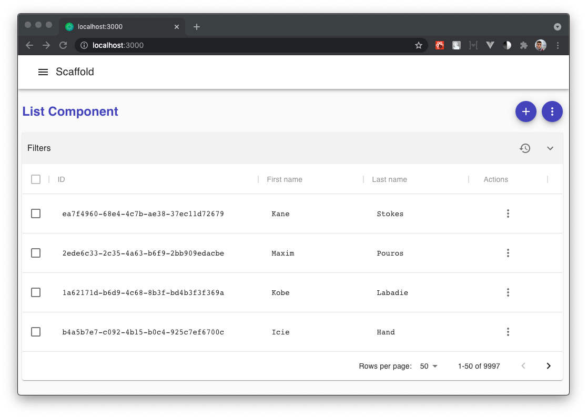
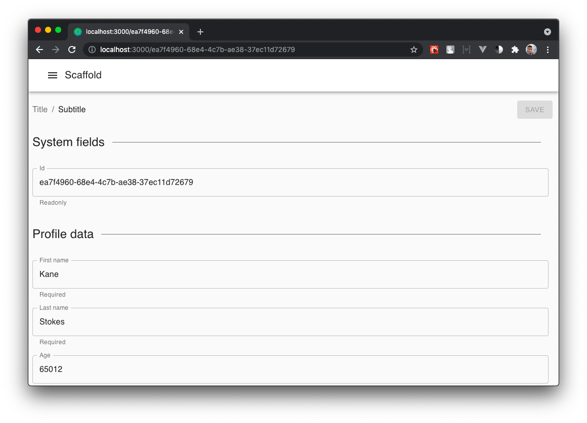

# react-declarative

> Пример архитектуры React + Mobx приложения

## Поддержать проект

> [!IMPORTANT]
> Сделано с использованием [react-declarative](https://github.com/react-declarative/react-declarative), чтобы решить ваши проблемы. **⭐Star** and **💻Fork** будет крайне полезен

# Описание

В комплекте система сервисов, взаимодействующих через композицию. Она позволяет переслать пользователя на отдельную страницу нехватке прав доступа или ошибке. Также реализована инъекция токена в заголовки запросов после авторизации. Блокировка роутинга при несохраненных изменениях. Пагинация, сортировка, фильтры. Отображение списочной формы и формы элемента списка. Прочее.

# Запуск

```
npm install
npm start
npx open-cli http://localhost:3000/
```

# Скриншоты

## Списочная форма

> Форма элемента списка наглядно демонстрирует вывод элементов из CRUD c передачей параметров в GET запросе для сортировки, фильтрации, пагинации



## Форма элемента списка

> Форма элемента списка открывается по клику на элемент списка или кнопке "+" в правом верхнем углу. При несохраненных данных роутинг блокируется


